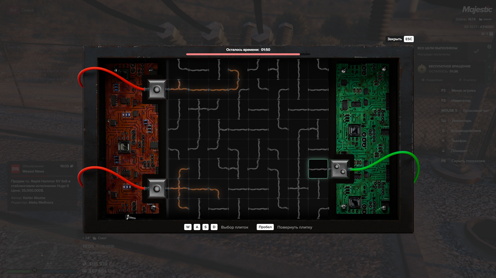
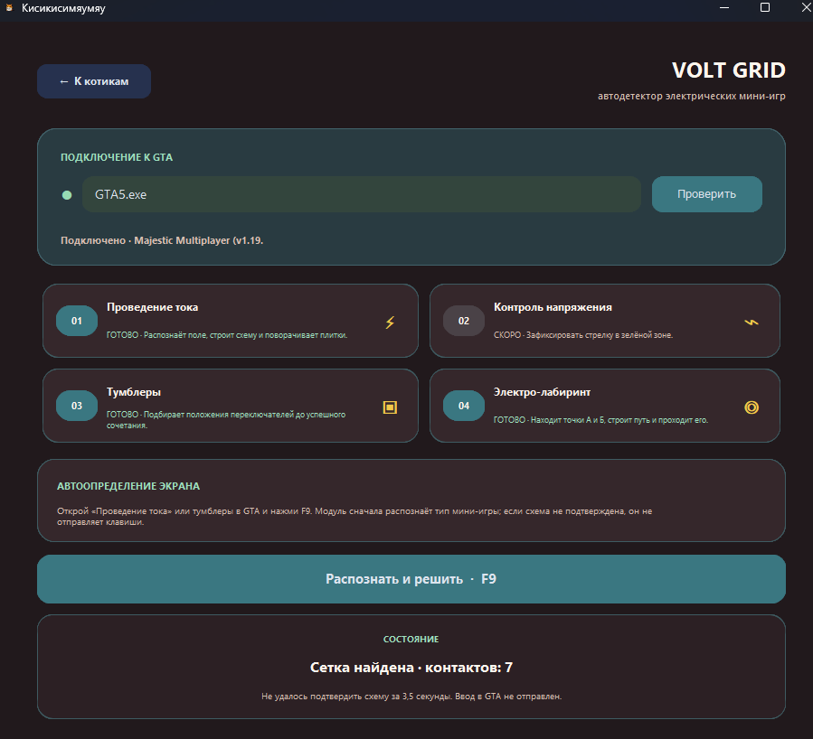
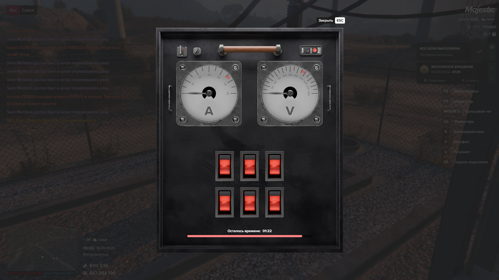
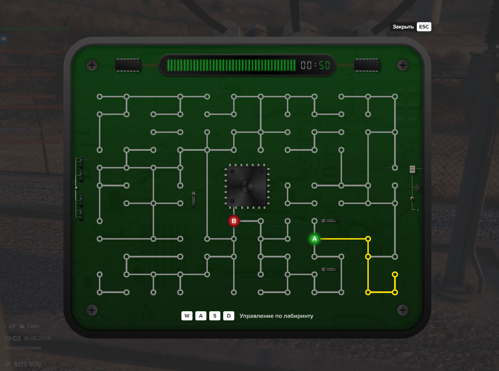
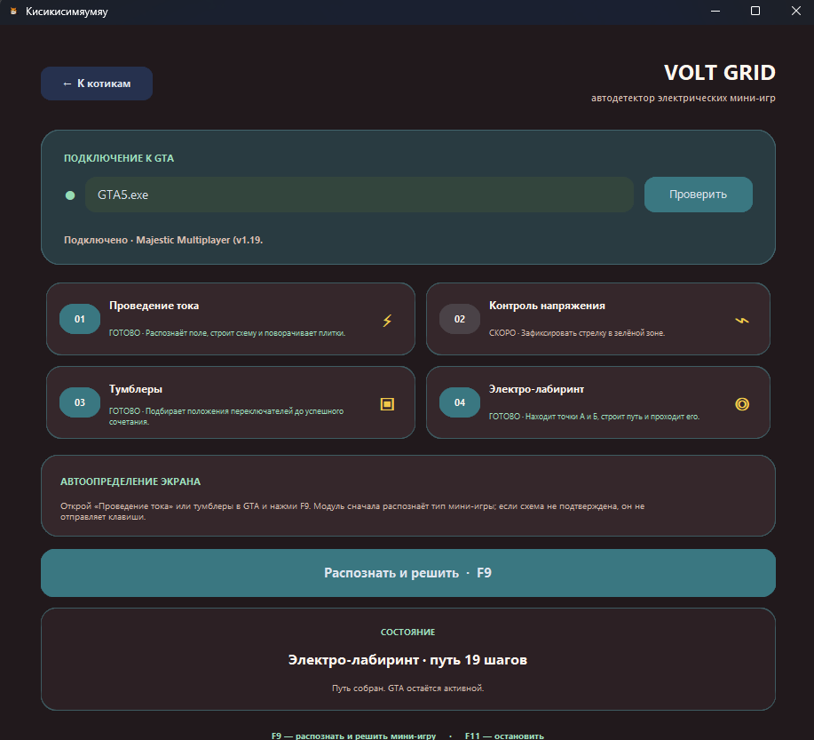
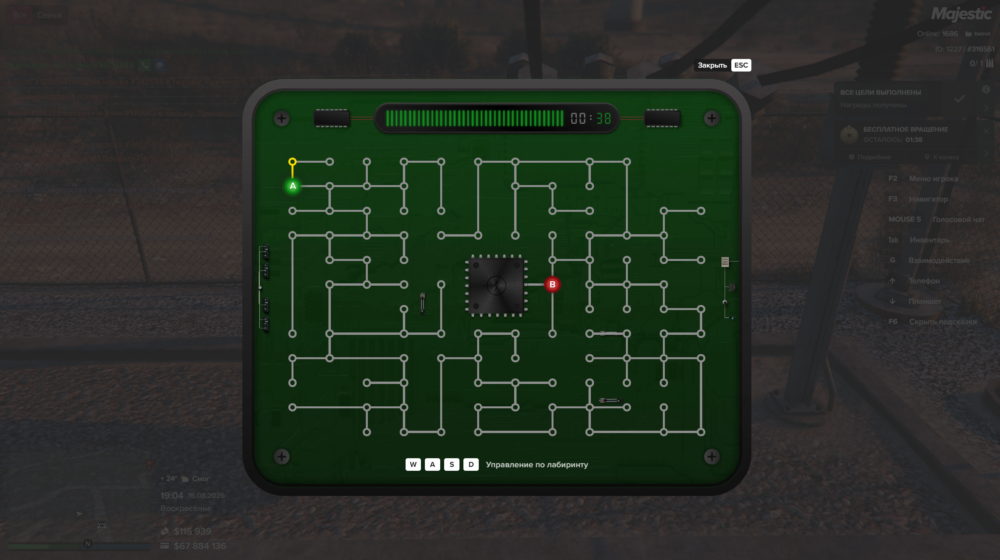
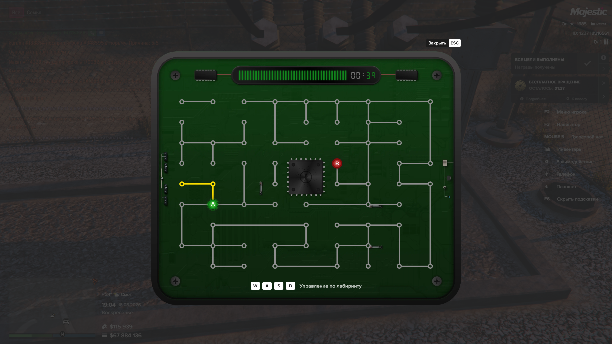
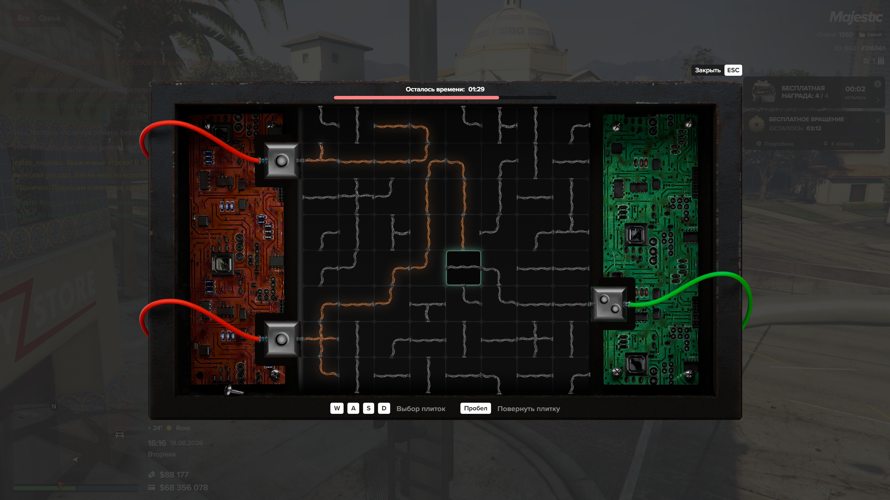

# Баг-фиксы VOLT GRID

Скриншоты и воспроизводимые проблемы от 16.08.2026.

## 1. Проведение тока

**Симптом:** модуль иногда объявлял, что нашёл сетку, но показывал неверное число контактов и не нажимал `W/A/S/D/Space`.

**Причина:** размер поля был задан константами, а фактическая сетка меняется вместе с интерфейсом и разрешением. Из-за этого решатель получал неверные плитки и корректно останавливался без ввода.

**Фикс:** определять границы и шаг сетки по линиям на текущем экране, передавать размерность в решатель и исполнять план только после проверки маршрута.

## 2. Тумблеры

**Симптом:** экран с шестью переключателями не определялся.

**Причина:** фильтр красных компонентов был рассчитан на крупный интерфейс и отбрасывал реальные рычаги при другом масштабе.

**Фикс:** искать повторяющиеся красные области относительно размеров экрана, а не по фиксированному размеру, поддерживая любую сетку переключателей.

## 3. Электро-лабиринт

**Симптом:** маршрут находился, выполнялось несколько шагов, затем модуль останавливался.

**Причина:** во время исполнения путь повторно проверялся как новый экран; после первых шагов жёлтая трасса меняла картинку, и распознавание ошибочно считало мини-игру закрытой.

**Фикс:** маршрут фиксируется один раз до начала ввода. Во время прохождения
проверяется наличие и активность окна GTA, без повторного детекта платы.

Дополнительно быстрый цветовой детектор теперь сразу определяет, что открыт
электролабиринт. Тяжёлое восстановление графа выполняется в фоне и больше не
замораживает интерфейс на несколько секунд.

## 4. Постоянный автодетект

**Симптом:** перед каждой новой мини-игрой приходилось снова нажимать F9.

**Фикс:** F9 теперь включает режим наблюдения на всю рабочую сессию. После
решения проведения тока, тумблеров или лабиринта Вольт автоматически
возвращается к поиску следующей мини-игры. Повторное нажатие F9 или F11
останавливает режим.

## 5. Ложная ветвь на сложном поле тока

**Симптом:** простые поля решались, но на сложной схеме Вольт мог решить, что
обе цепи уже подключены, и не отправить ни одной клавиши, хотя индикаторы
оставались серыми.

**Причина:** область проверки конца провода заходила на металлический стык
между соседними клетками. На некоторых углах этот стык ошибочно становился
третьей ветвью, и решатель видел несуществующий путь до выхода.

**Фикс:** концы проводов теперь проверяются глубже внутри плитки меньшим окном,
не захватывающим её границу. Сложный кадр добавлен в регрессионные тесты.

## 6. Ложное распознавание тумблеров во время езды

**Симптом:** постоянный автодетект мог объявить тумблеры на обычном игровом
экране, начать ввод и затем выключиться из-за несовпадения.

**Причина:** нескольких похожих красных и зелёных областей было достаточно для
предварительного определения раскладки. На дороге такую комбинацию иногда
давали фонари, транспорт и HUD.

**Фикс:** до первого клика Вольт теперь требует ровную центральную сетку,
одновременное наличие двух приборов с красными зонами и второй совпадающий
кадр подряд.

## 7. Накопление ошибки при измерении тумблеров

**Симптом:** на части раскладок перебор всех переключателей завершался
сочетанием, в котором одна или обе стрелки оставались рядом с красной зоной.

**Причина:** прирост очередного тумблера вычислялся относительно предыдущего
кадра. Если стрелка ещё двигалась, небольшая ошибка переходила в следующий
замер и накапливалась к концу калибровки.

**Фикс:** каждый переключатель измеряется независимо от одного нулевого
положения, показание подтверждается повторным кадром после остановки стрелок,
а измеренный тумблер сразу возвращается в ноль.
